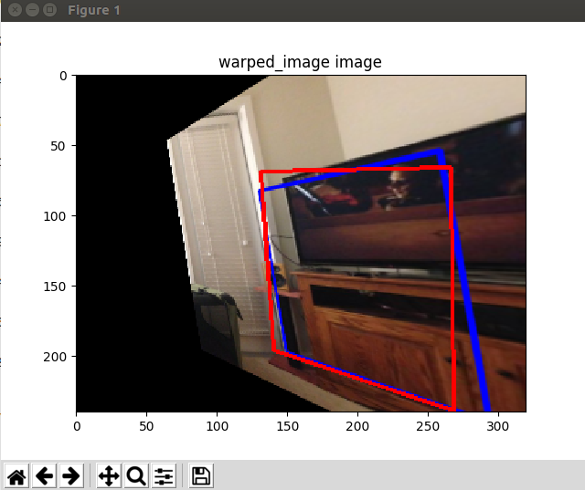
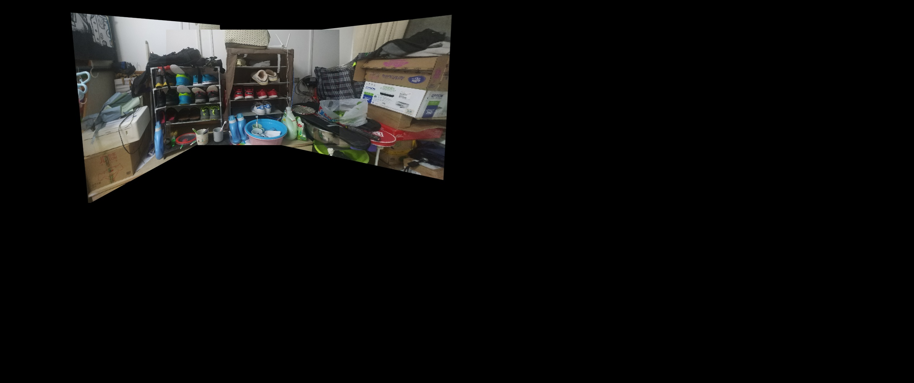
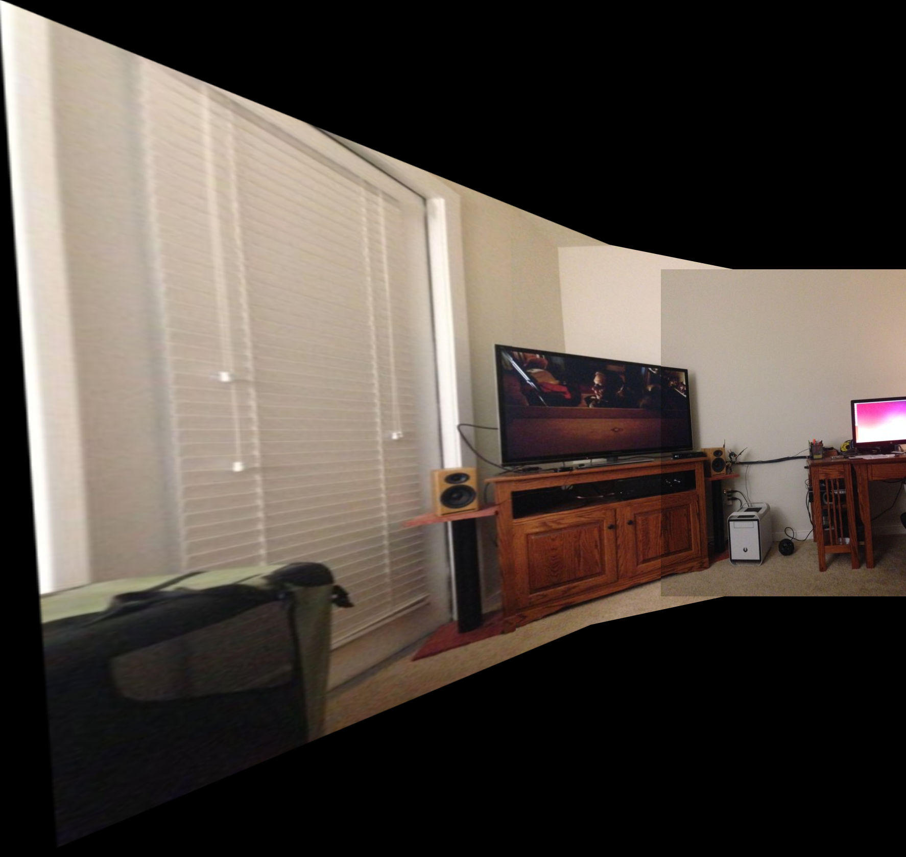

# Image-stitcher

### (1)使用Opencv里的特征点提取计算单应矩阵（3*3）进行图片拼接

##### 原图

##### 特征点提取

#### 拼接结果

### (2)使用CNN 来提取特征点来计算单应矩阵 进行图片拼接

#### 原始图片

#### 变化图片

### (3)使用无监督的方法

#### 评估方法

### (4) 计算误差的方法： MACE (Mean Ave. Corner Error)

200次 :('Ave. Corner Error: ', '270.4477227329222')

1000次：('Ave. Corner Error: ', '73.6007446534849')

1500次: ('Ave. Corner Error: ', '29.251779516979852')

2000次: ('Ave. Corner Error: ', '18.5930111695279')

2500次：('Ave. Corner Error: ', '33.376567003494486')

3000次：('Ave. Corner Error: ', '13.580795411811724')

3300次：('Ave. Corner Error: ', '12.752348838147412')

3500次：('Ave. Corner Error: ', '14.825207152339242')

4000次 ('Ave. Corner Error: ', '10.80694904146016')

4500次 ('Ave. Corner Error: ', '15.91566891431385')

5000次 ('Ave. Corner Error: ', '15.903593176981435')

 

训练到后面会经常出现 四角中两个角的误差很小 有一个或者两个角的误差大 导致整体的误差变大

### 文件功能：

（1）change_test.py  编写了get_test2 方便之后计算两张图片的H矩阵

（2）change_test.py 用于测试并计算MACE

（3）Hnet_train.py 用于训练

### 图像拼接：

（1）传统方法的拼接 

(2) 传统方法的拼接二

#### Tips

[Homography Net](https://arxiv.org/pdf/1606.03798.pdf)

[Homography Net](https://blog.csdn.net/ajing2014/article/details/53998866)
