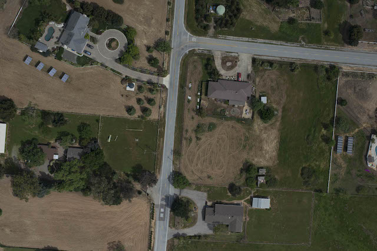
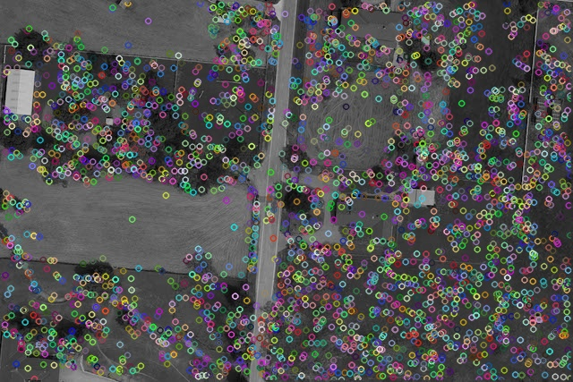
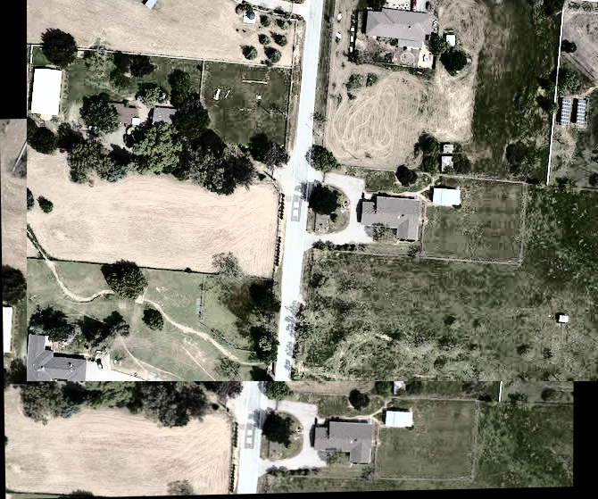
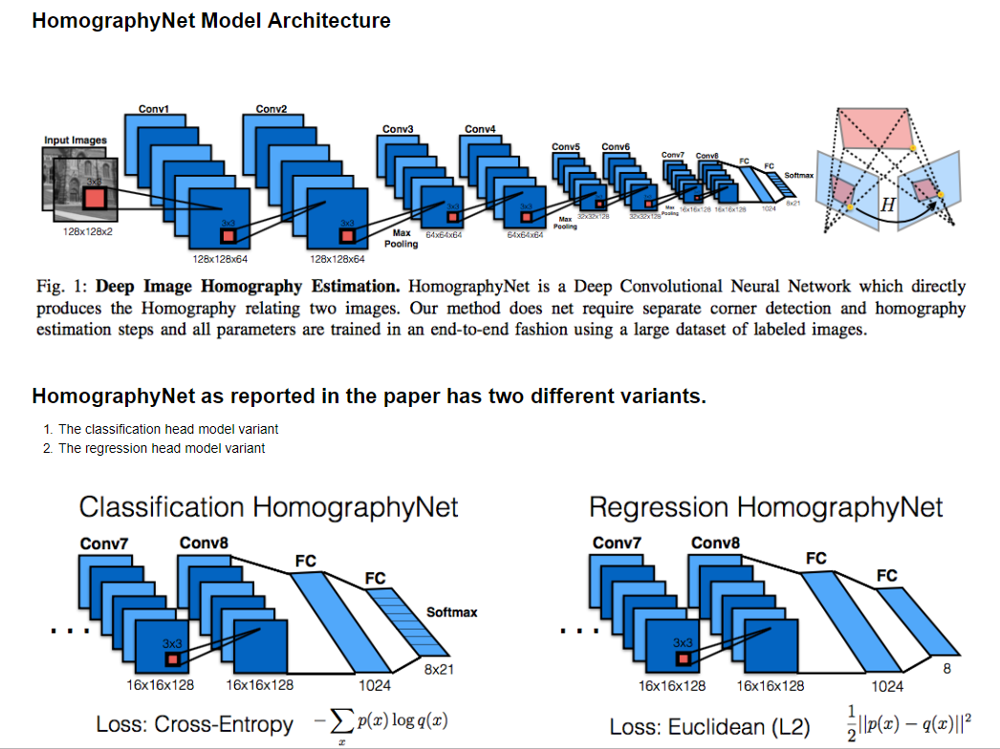
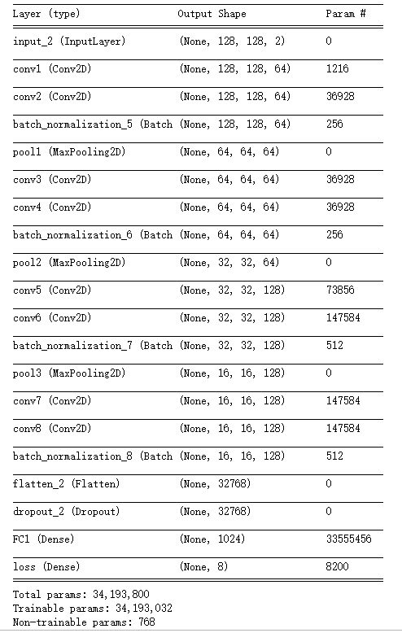

# Image-stitcher

### (1)使用Opencv里的特征点提取计算单应矩阵（3*3）进行图片拼接

##### 原图

##### 特征点提取

#### 拼接结果

### (2)使用CNN 来提取特征点来计算单应矩阵 进行图片拼接

#### Tips

[Homography Net](https://arxiv.org/pdf/1606.03798.pdf)

[Homography Net](https://blog.csdn.net/ajing2014/article/details/53998866)
