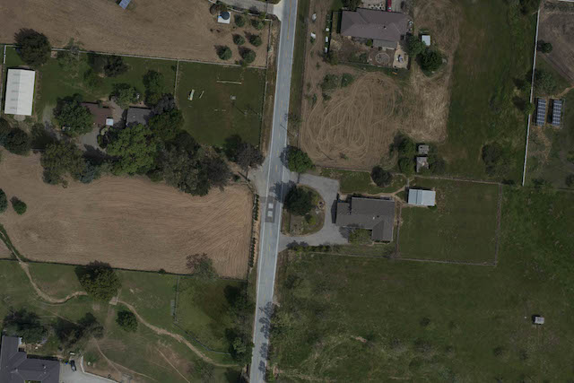
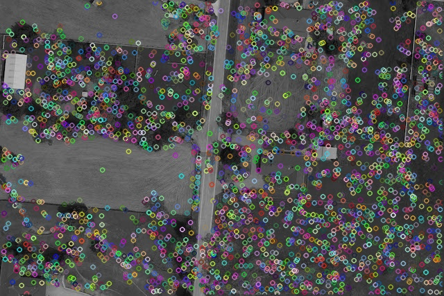
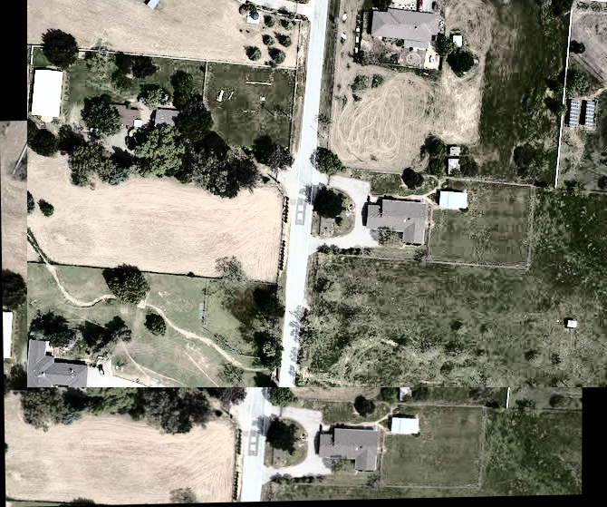
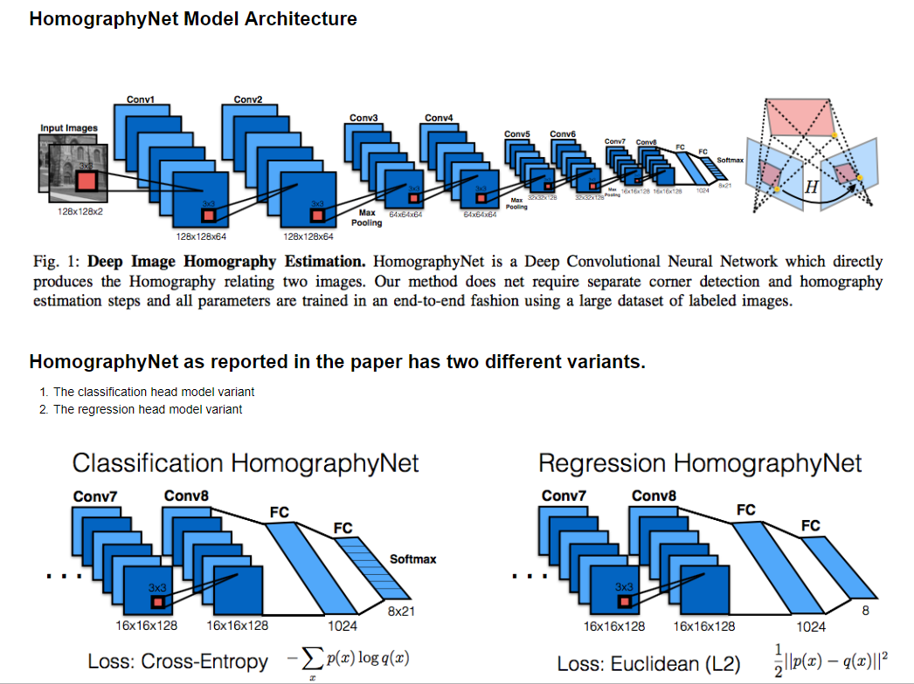
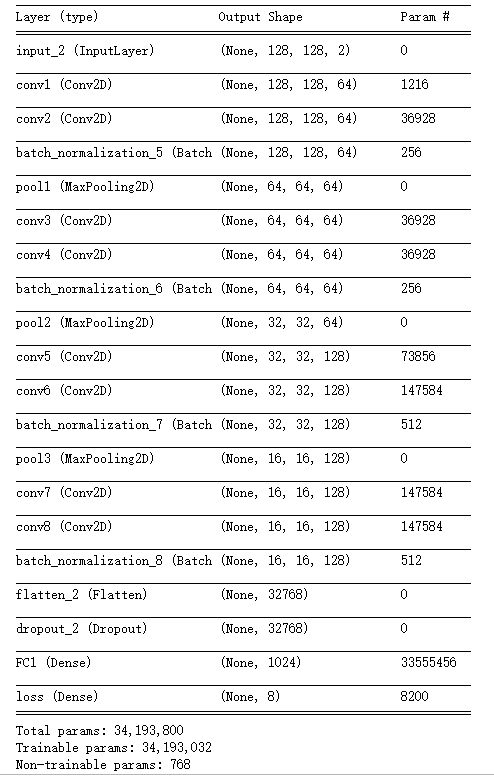
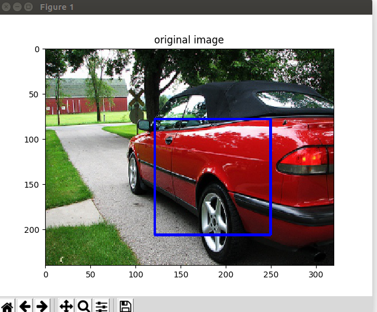
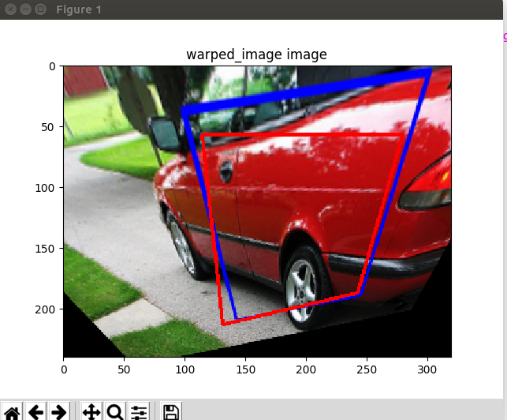
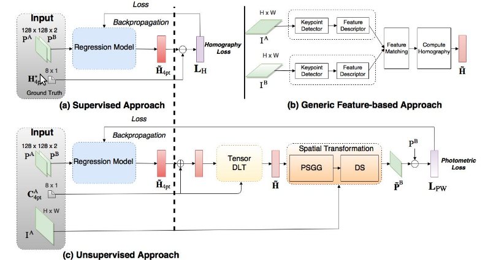
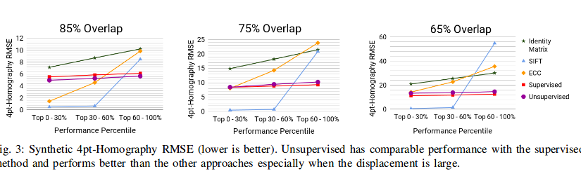
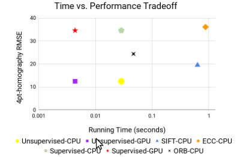

# Image-stitcher

### (1)使用Opencv里的特征点提取计算单应矩阵（3*3）进行图片拼接

##### 原图

##### 特征点提取

#### 拼接结果

### (2)使用CNN 来提取特征点来计算单应矩阵 进行图片拼接

#### 原始图片

#### 变化图片

### (3)使用无监督的方法

#### 评估方法

### (4) 计算误差的方法： MACE (Mean Ave. Corner Error)

200次 :('Ave. Corner Error: ', '270.4477227329222')

1000次：('Ave. Corner Error: ', '73.6007446534849')

### 文件功能：

（1）change_test.py  编写了get_test2 方便之后计算两张图片的H矩阵

（2）change_test.py 用于测试并计算MACE

（3）Hnet_train.py 用于训练

#### Tips

[Homography Net](https://arxiv.org/pdf/1606.03798.pdf)

[Homography Net](https://blog.csdn.net/ajing2014/article/details/53998866)
